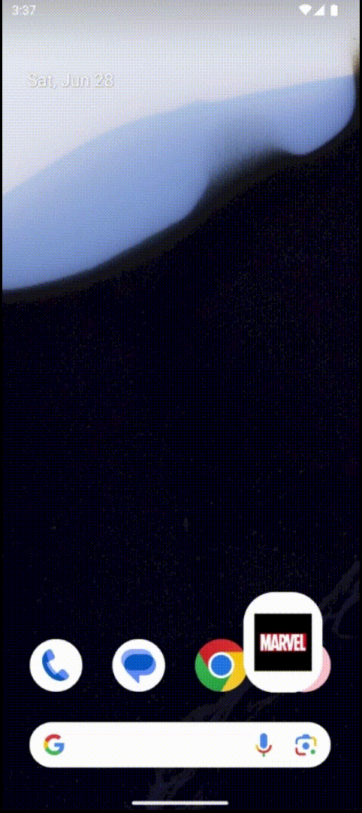

# 🦸 Marvel Comics - Flutter

Um app em Flutter que consome a API da Marvel para explorar personagens, quadrinhos, eventos e mais. Você pode pesquisar, visualizar detalhes e favoritar seus conteúdos preferidos.

## 📌 Tecnologias Utilizadas

- Flutter + Dart
- API da Marvel
- Provider (gerenciamento de estado)
- Shared Preferences (persistência local)
- Animações com `AnimatedOpacity`
- Widgets customizados

## 🚀 Como Executar

1. **Clone o repositório:**

   ```sh
   git clone https://github.com/erizoka/marvel-comics-api
   cd marvel-comics-api
   ```

2. **Instale as dependências:**

   ```sh
    flutter pub get
   ```

3. **Execute o app:**

   ```sh
    flutter run
   ```

🔹 **Importante:** Este projeto utiliza a API da Marvel, sendo necessário configurar o arquivo `.env` com suas credenciais:

Crie o arquivo `.env` na raiz do projeto e adicione as seguintes variáveis:

```sh
baseUrl=https://gateway.marvel.com/v1/public
pubkey=sua_public_key_aqui
pvtkey=sua_private_key_aqui
```

Você pode obter as chaves criando uma conta gratuita em: [https://developer.marvel.com](https://developer.marvel.com)

Sem essas chaves, as funcionalidades de busca e listagem não irão funcionar corretamente.

## 🔍 Funcionalidades

- 🔎 Pesquisa dinâmica por personagens e quadrinhos
- ⭐ Favoritar e visualizar favoritos
- 📖 Detalhes de cada personagem, comic e evento
- 🖼️ Carrosséis, grid e layout responsivo
- 🔃 Pull to refresh
- 🎬 SplashScreen animada com transição de logo Marvel

## 📷 Capturas de Tela

### 🏠 Home e Detalhes

```sh
~api fora do ar, prints serão adicionados quando normalizar
```

<!-- <table>
  <tr>
    <td></td>
    <td></td>
    <td></td>
  </tr>
</table> -->

### 🔎 Pesquisa e Favoritos

```sh
~api fora do ar, prints serão adicionados quando normalizar
```

<!-- <table>
  <tr>
    <td></td>
    <td></td>
  </tr>
</table> -->

### 🎬 SplashScreen



## 📄 Licença

Este projeto está sob a licença MIT. Veja o arquivo [LICENSE](LICENSE) para mais detalhes.

---

Desenvolvido por [Erica Esteves](https://github.com/erizoka). 🚀
